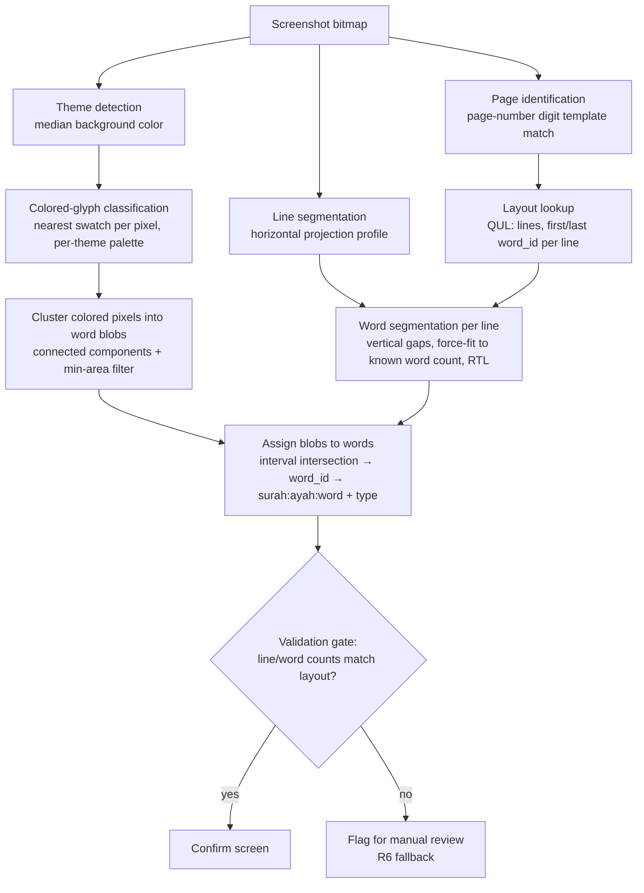
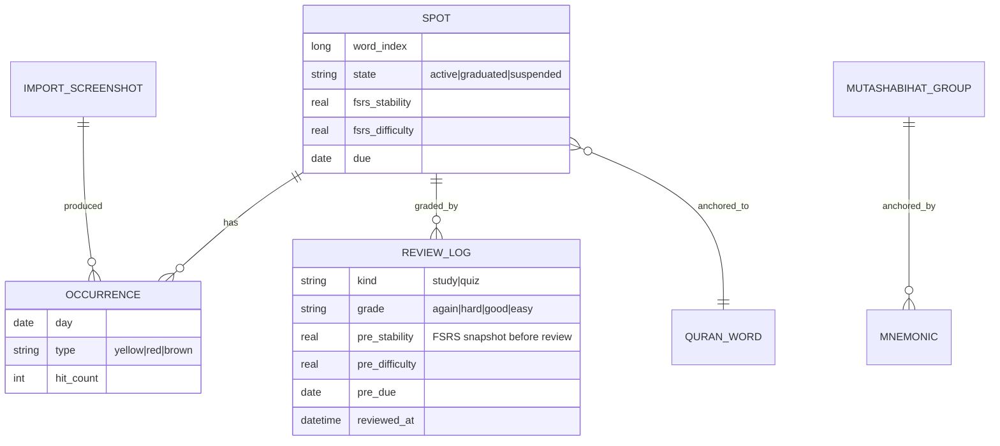

# feat: Tarteel Companion v1 — import, study, and quiz loop

## Overview

Build a greenfield Android app (Kotlin, Jetpack Compose) that imports Tarteel session screenshots, extracts recitation-mistake positions fully on-device with a deterministic geometric pipeline (no OCR, no cloud), and turns them into a spaced-repetition study loop: full-passage recall flashcards with mutashabihat comparisons and Arabic mnemonics, followed by scored cold-recall quizzes. Personal tool, single user, public repo, bring-your-own LLM key.

---

## Problem Frame

The user's Tarteel screenshots — which mark pronunciation mistakes (yellow), wrong-word substitutions (red), and prompt-needed spots (brown) — pile up unreviewed; the mistake data never becomes targeted review (see origin: `docs/brainstorms/2026-07-12-tarteel-companion-requirements.md`). Tarteel offers no export or API, so screenshots are the only data path out. This plan implements the full v1 loop the origin defines: import → extract → confirm → study → quiz, with graduation.

---

## Requirements Trace

- R1–R7: Import and extraction (share sheet/picker, on-device deterministic CV, three mistake types, canonical word anchoring, confirm/correct screen, manual fallback, dedup/history semantics).
- R8–R14: Study plan (full-passage recall cards, self-grading, SRS scheduling, mutashabihat comparisons from dataset, LLM-drafted editable mnemonics with graceful offline degradation, type-driven reveal emphasis).
- R15–R17: Cold-recall quiz (delayed, aids hidden, scored, failures return to study).
- R18–R23 (origin Planning Addendum): card front = reference + preceding-ayah lead-in; one card per ayah with per-spot scheduling; graduation = quiz-pass at mature interval; session-view colored-glyph screenshots; Arabic-only mnemonics; public repo with BYO API key.

**Origin actors:** A1 (the reciter/user), A2 (Tarteel app — screenshot source only, no integration), A3 (LLM service — optional mnemonic drafting, never required).
**Origin flows:** F1 (import and extract), F2 (study session), F3 (cold-recall quiz).
**Origin acceptance examples:** AE1 (covers R3, R4), AE2 (covers R5, R6), AE3 (covers R11–R13), AE4 (covers R15–R17).

---

## Scope Boundaries

### Deferred for later

*(carried from origin)*

- Progress dashboards / analytics over time (streaks, per-surah heatmaps).
- Automatic detection of new Tarteel screenshots (watching the screenshots folder).
- Audio playback of a qari's recitation on cards.
- Cloud sync, backup, or multi-device support.
- iOS version.

### Outside this product's identity

*(carried from origin)*

- Speech recognition or any audio-based grading of recitation.
- Teaching new memorization or tajweed instruction.
- Replacing Tarteel or re-implementing its recitation-following features.
- A general-purpose flashcard app; cards exist only as projections of imported mistake spots.

### Deferred to Follow-Up Work

*(plan-local implementation sequencing)*

- Tesseract-based OCR fallback for page identification when the page number is not visible — only if the U3 spike shows the page-number route is insufficient (future iteration).
- QPC per-page glyph fonts (QCF V2, ~50–100 MB) for pixel-exact mushaf rendering — v1 renders with the single KFGQPC Uthmanic Script HAFS font (future iteration if line-accurate rendering proves necessary for the confirm screen).
- Groq as a second LLM provider behind the same interface (v1 ships Gemini Flash only; the client is abstracted so adding Groq is additive).
- Background-highlight (mistake-history view) screenshot support — v1 targets session-view colored glyphs per R21; the color-classification stage is written to make adding the highlight-rect case additive.

---

## Context & Research

### Relevant Code and Patterns

Greenfield repository — no existing code. Patterns come from external prior art:

- [quran/ayah-detection](https://github.com/quran/ayah-detection) — line segmentation of mushaf images via horizontal projection profiles; the direct model for U4's geometry.
- QUL mushaf layout schema (`pages`: page_number, line_number, line_type, first_word_id, last_word_id; `words`: word_index, word_key, surah, ayah, text) — the backbone of both extraction anchoring and card rendering.

### External References

- QUL — Quranic Universal Library (Tarteel's own open-data site): [word-by-word scripts](https://qul.tarteel.ai/resources/quran-script), [mushaf layouts](https://qul.tarteel.ai/resources/mushaf-layout), [mutashabihat JSON](https://qul.tarteel.ai/resources/mutashabihat). SQLite/JSON downloads, offline-bundleable. Dataset-level license text not published — flagged in Risks.
- [Waqar144/Quran_Mutashabihat_Data](https://github.com/Waqar144/Quran_Mutashabihat_Data) — huffaz-focused similar-verse list (optional overlay dataset).
- [open-spaced-repetition/FSRS-Kotlin](https://github.com/open-spaced-repetition/FSRS-Kotlin) — pure-Kotlin FSRS v6, MIT; small enough to vendor.
- [Gemini API rate limits](https://ai.google.dev/gemini-api/docs/rate-limits) — free tier covers Flash; ample for occasional mnemonic drafting.
- Tarteel support docs: [text colours](https://support.tarteel.ai/en/articles/12160141-what-do-the-different-text-colours-mean) — session view renders mistakes as colored text (matches R21); official semantics (yellow = tashkeel, brown = peeked) approximately match the user's (yellow = pronunciation, brown = prompted).
- ML Kit Text Recognition [does not support Arabic](https://developers.google.com/ml-kit/vision/text-recognition/v2/languages); Tesseract is weak on diacritic-dense Uthmani script — this is why the pipeline is geometric, not OCR-based.

### Institutional Learnings

None — `docs/solutions/` does not exist yet in this repo.

---

## Key Technical Decisions

- **No OCR; geometric extraction against bundled layout data**: page identification + projection-profile line/word segmentation, validated against QUL layout counts (exact word counts per line are known ahead of time). Deterministic, testable as pure functions, no native dependencies. Rationale: origin R2 demands deterministic on-device extraction; OCR options are all weak on Uthmani script.
- **Pure Kotlin pixel processing, no OpenCV/ML Kit/Tesseract in v1**: screenshots are synthetic flat-color UI renders; nearest-swatch color classification over raw pixel arrays plus connected-component grouping is a few hundred lines and keeps the APK free of native libs. The extraction package takes a plain pixel-array input (`IntArray` + dimensions, or a small `PixelGrid` value type) and contains zero `android.graphics` references — a thin device-side adapter converts `Bitmap` → pixels, and JVM tests decode `samples/` via `ImageIO`. This is what lets the golden suites run in plain JVM without Robolectric. *(Execution deviation, recorded post-completion: `javax.imageio` is not on the Android unit-test compile classpath (android.jar), so the golden suites decode via Robolectric NATIVE-mode `BitmapFactory` instead — the extraction package itself remains free of `android.graphics` as planned.)*
- **Color classification on full RGB against calibrated per-theme swatches, not hue thresholds**: brown is dark desaturated yellow — hue-only rules will confuse R3's yellow/brown distinction. Swatches are sampled from real screenshots in the U3 spike and stored as constants with a distance threshold.
- **Stack: Kotlin + Jetpack Compose + Room + WorkManager + DataStore; single module**: default modern Android stack; no CV library constraint pushes toward anything else. Single-module keeps a personal project simple; packages provide the layering.
- **Bundled data: QUL QPC-Hafs word-by-word SQLite + QUL KFGQPC V2 (1421H, 604-page/15-line Madani) layout + QUL mutashabihat JSON**: one coherent source, run by Tarteel themselves, maximizing layout-match odds with the Tarteel app. Which QUL layout ID actually matches Tarteel's rendering is verified empirically in U3.
- **Rendering: single KFGQPC Uthmanic Script HAFS font**: readable Uthmani rendering without 604 per-page fonts. The confirm screen renders lines from layout data (line N contains words i..j), which is positionally faithful enough for tap-to-correct without pixel-exact glyph metrics.
- **SRS: vendored FSRS-Kotlin (MIT), FSRS v6 default parameters**: outperforms hand-rolled SM-2 at zero extra cost; card state (stability, difficulty, due) stored per spot in Room.
- **Scheduling authority invariant**: each spot gets exactly one scheduling-effective review per study→quiz cycle. The quiz grade supersedes the preceding study grade (quiz Again/Hard = lapse back to study queue; quiz Good/Easy = confirms the interval). Prevents the double-counting the flow analysis flagged.
- **Occurrence granularity = (position, calendar day)**: same-position detections within one day collapse into one occurrence with a hit count. Mistake type is per-occurrence; card emphasis (R14) follows the most recent occurrence; any new occurrence on an active or graduated spot triggers an FSRS lapse/reactivation (R7, R20).
- **LLM: Gemini Flash via direct REST (OkHttp/Ktor), BYO key in DataStore (R23)**: Firebase AI Logic would hide a bundled key, but this app deliberately has no bundled key, so plain REST with the user's own key is simpler and dependency-light. Client sits behind a small interface so Groq can be added later. Only canonical verse references/text are ever sent (R13).
- **Original screenshots are not retained after confirm**: store a content hash (for duplicate detection, R7/I1) and a small thumbnail for history; discard the full image. Bounded storage on a personal device.

---

## Open Questions

### Resolved During Planning

- Card front content: reference + preceding-ayah lead-in (R18, user decision).
- Card grouping for clustered mistakes: one card per ayah, grade fans out to contained spots (R19, user decision).
- Graduation rule: cold-quiz pass at Good+ with interval ≥ 21 days → archived; re-import reactivates with lapse (R20, user decision).
- Screenshot source: session view, colored glyphs (R21, user decision).
- Mnemonic language: Arabic only (R22, user decision).
- Key handling in a public repo: BYO key, on-device only (R23, user decision).
- Quiz→SRS interaction, dedupe, confirm-screen exits, brown-spot passage construction, quiz eligibility/supersession, mid-quiz abandonment, "poorly graded" = Again/Hard: adopted the flow-analysis defaults; each is specified in its owning unit below.
- Flow-analysis M4 (adopted): designed empty states on every tab pointing at Import, plus optional review-ahead when nothing is due. This is the trace behind U7's policy invariant (5), U8's empty state, and U12's empty-state scope.
- Mnemonics exist only for spots with a mutashabihat mapping; other spots show a bare passage card with an optional user-authored note. (Flow-analysis M1, adopted as intended.)

### Deferred to Implementation

- Exact Tarteel highlight/text ARGB values per theme: measurable only from real screenshots (U3 spike output).
- Which QUL mushaf layout ID matches Tarteel's rendering, and whether Tarteel's word wrap follows the printed page at all in the user's reading mode: U3 spike verifies; if Tarteel uses a reflowing (non-mushaf) layout, U4's page-matching strategy pivots to line-text matching against the word DB — flagged as the plan's biggest risk.
- Whether the page number is reliably visible in session-view screenshots (fallback ordering inside U4 depends on it).
- Word-gap segmentation thresholds and force-fit heuristics: tuned against the spike corpus.
- FSRS parameter tweaks, exact passage word-count cap, and quiz session size cap: set during implementation with real usage.
- Gemini prompt wording for Arabic mnemonics and the JSON response contract: iterated at implementation time.

### From 2026-07-12 review

- [Affects U6][Design decision] Word tap-target strategy on dense 15-line mushaf pages: padded hit-boxes independent of glyph width vs. pinch-zoom vs. tap-then-refine word picker. Needs a build in hand to judge; resolve during U6. (design-lens)
- [Affects U6][Design decision] Tap-to-correct interaction model on the confirm screen: how one tap disambiguates cycle vs. add vs. remove, the cycle order, and how a multi-word blob is corrected per-word. Resolve during U6. (design-lens)
- [Affects U8/U11][Design decision] Post-grade behavior: auto-advance vs. confirm, and whether a mis-tapped Again/Hard/Good/Easy grade has a short correction window before it mutates FSRS state. Resolve during U8. (design-lens)

---

## Output Structure

*(scope declaration, not a constraint — implementer may adjust)*

    app/
      src/main/kotlin/com/tarteelcompanion/
        data/            # Room DB, DAOs, entities; bundled-asset loaders
        quran/           # read-only Quran data access: words, layout, mutashabihat
        extraction/      # pure-Kotlin pixel pipeline over raw pixel arrays (zero android.* refs)
        importflow/      # picker/share-sheet intake, batch queue, confirm screen
        srs/             # vendored FSRS-Kotlin + scheduling policy
        study/           # card construction, study session UI
        quiz/            # quiz eligibility, session, scoring
        mnemonics/       # LLM client, generation queue, settings
        ui/              # theme, navigation, shared composables, empty states
      src/main/assets/   # quran-words.db, mushaf-layout.db, mutashabihat.json, font
      src/test/          # JVM unit tests (extraction golden tests, scheduling, card construction)
      src/androidTest/   # Room + Compose smoke tests
    samples/             # real Tarteel screenshots for the spike (gitignored by default)
    docs/brainstorms/  docs/plans/

---

## High-Level Technical Design

> *This illustrates the intended approach and is directional guidance for review, not implementation specification. The implementing agent should treat it as context, not code to reproduce.*

Extraction pipeline (U3 validates stages 1–3 empirically; U4 implements all):

Core data relationships (Room):

---

## Implementation Units

### Phase A — Foundations and feasibility

- U1. **Project scaffold and repo hygiene**

**Goal:** A building, runnable empty Compose app with navigation shell, plus public-repo hygiene.

**Requirements:** structural (enables all); R23 (README documents BYO key).

**Dependencies:** None.

**Files:**
- Create: `settings.gradle.kts`, `build.gradle.kts`, `app/build.gradle.kts`, `gradle/libs.versions.toml`, `app/src/main/AndroidManifest.xml`, `app/src/main/kotlin/com/tarteelcompanion/MainActivity.kt`, `app/src/main/kotlin/com/tarteelcompanion/ui/Navigation.kt`, `.gitignore`, `README.md`, `LICENSE`
- Test: none in this unit (scaffold)

**Approach:**
- Kotlin, Jetpack Compose (BOM), Room, WorkManager, DataStore, single `app` module; min SDK ~26.
- Navigation shell declares five bottom-nav destinations from the start — Home / Import / Study / Quiz / Archive, with Settings reachable from an icon on Home — so U12's screens have reserved slots and no late navigation refactor.
- Manifest sets `android:allowBackup="false"` (or a `dataExtractionRules` exclusion for the key-storage file) so Auto Backup never sweeps the API key into cloud backup or device-to-device transfer (pairs with U10's key handling).
- `.gitignore` covers Android defaults plus `samples/` (real screenshots stay local unless the user opts to commit them) and any local key files.
- README states: personal project, public repo, no bundled API key — each user supplies their own Gemini key in Settings (R23).

**Test scenarios:**
- Test expectation: none — pure scaffolding; U2+ carry the tests.

**Verification:**
- `gradlew assembleDebug` succeeds; app launches to the Home tab with bottom-nav stubs (Home / Import / Study / Quiz / Archive) and Settings reachable from Home.

---

- U2. **Bundled Quran data layer**

**Goal:** Read-only access to word-indexed Quran text, mushaf layout, and mutashabihat groups from bundled assets.

**Requirements:** R4, R11; foundation for R8, R18.

**Dependencies:** U1.

**Files:**
- Create: `app/src/main/kotlin/com/tarteelcompanion/quran/QuranRepository.kt`, `app/src/main/kotlin/com/tarteelcompanion/quran/model/` (Word, AyahRef, MushafLine, MutashabihatGroup), `app/src/main/assets/quran-words.db`, `app/src/main/assets/mushaf-layout.db`, `app/src/main/assets/mutashabihat.json`, asset-loader in `data/`
- Test: `app/src/test/kotlin/com/tarteelcompanion/quran/QuranRepositoryTest.kt`

**Approach:**
- Download QUL QPC-Hafs word-by-word SQLite, QUL KFGQPC V2 mushaf layout SQLite, and QUL mutashabihat JSON; bundle as assets, open read-only via Room `createFromAsset` (or raw SQLite for the read-only DBs).
- Query surface: word by `word_index`; ayah text (joined words) by (surah, ayah); page lines with word ranges by page number; preceding ayah lookup (crossing surah boundaries returns null at surah start — feeds R18); mutashabihat groups containing a given (surah, ayah) or word range.
- Record dataset provenance in README. License gate: the QUL asset files stay out of git (local assets or a download-on-first-build step, same pattern as `samples/`) until QUL confirms redistribution terms — development proceeds locally in the meantime (see Risks).

**Patterns to follow:** QUL layout schema as documented (pages/words tables).

**Test scenarios:**
- Happy path: word_index for (2:255, word 1) returns the correct Arabic text; ayah word count for 1:1 is 4.
- Happy path: page lines for page 1 return line_type sequence including surah_name and basmallah rows, and word ranges covering all of al-Fatiha's words on that page.
- Edge case: preceding-ayah lookup at 2:1 (surah start) returns null; at 2:2 returns 2:1.
- Edge case: mutashabihat lookup for an ayah known to be in a group returns its group with all member refs; lookup for an ayah in no group returns empty.
- Edge case: whole-corpus invariant — every layout line's word range resolves to rows in the words DB, and per-ayah word counts reconcile with/without ayah-end marker entries (the test documents whether markers occupy word slots in the layout's ID space).

**Verification:**
- JVM tests pass against the real bundled databases; spot-check totals (6236 ayat, ~77.4k words, 604 pages).

---

- U3. **Extraction feasibility spike (colored-glyph detection + layout match)**

**Goal:** Empirically validate the plan's riskiest assumptions against 15–30 real screenshots before building the full pipeline; produce calibrated constants.

**Requirements:** de-risks R2–R4, R21.

**Dependencies:** U2 (layout data for cross-checking). User must supply real screenshots into `samples/` covering: both/all themes they use, several pages, all three mistake colors, and at least one page screenshotted twice.

**Files:**
- Create: `app/src/test/kotlin/com/tarteelcompanion/extraction/SpikeHarnessTest.kt` (JVM golden-test harness reading `samples/`), `app/src/main/kotlin/com/tarteelcompanion/extraction/ColorClassifier.kt`, `docs/solutions/extraction-spike-findings.md`
- Test: the spike *is* tests.

**Approach:**
- Measure actual ARGB values of red/yellow/brown mistake glyphs and normal text per theme; verify yellow-vs-brown separability with full-RGB nearest-swatch distance; record swatch constants.
- Verify whether Tarteel's session view lays text out like a QUL mushaf layout (line breaks match some layout ID) or reflows text; check page-number visibility; note how ayah-end marker glyphs render (spacing, whether they read as separate "words" — feeds U2/U4's marker reconciliation).
- Characterize the bundled mutashabihat JSON alongside the pixel work (its shape is unverified and U9/U10 are designed against it): keying granularity (ayah vs. word-range), group-size distribution, coverage of the user's memorized portions, and a selection/cap rule for oversized groups. Record the verdict with a pivot path (e.g., the Waqar144 huffaz-focused overlay) if the shape doesn't fit.
- Decision checkpoint recorded in the findings doc: (a) layout matches → U4 proceeds as designed; (b) no page match but line text identifiable → U4 pivots to word-sequence matching (strip-diacritics n-gram match of segmented word counts per line against the word DB); (c) neither → stop and make an explicit R2 scope decision with the user before U4: ship v1 manual-first (R2 formally narrowed), wait for a different extraction strategy, or accept a longer U4 for the text-matching pivot. The decision is recorded in this plan — U4 does not start without it.

**Execution note:** Spike work — golden tests over the sample corpus are the deliverable; keep everything as pure JVM functions over pixel arrays.

**Test scenarios:**
- Happy path: for each sample screenshot, classifier finds ≥ the human-counted number of colored word blobs, correct color labels, zero false blobs on clean pages.
- Edge case: yellow and brown blobs in the same screenshot classify distinctly (the known-hard pair).
- Edge case: dark-theme sample (if the user uses one) classifies with its own palette.

**Verification:**
- `docs/solutions/extraction-spike-findings.md` records: measured swatches, layout-match verdict (a/b/c), page-number verdict, marker-rendering note, mutashabihat-shape verdict, and go/pivot decision for U4.

---

### Phase B — Extraction and import

- U4. **Deterministic anchoring pipeline**

**Goal:** Screenshot → list of (surah, ayah, word_index, mistake type) with a validation gate, per the High-Level Technical Design.

**Requirements:** R2, R3, R4; AE1.

**Dependencies:** U2, U3 (swatches + strategy verdict).

**Files:**
- Create: `extraction/PageIdentifier.kt`, `extraction/LineSegmenter.kt`, `extraction/WordSegmenter.kt`, `extraction/Anchorer.kt`, `extraction/ExtractionPipeline.kt` (all under `app/src/main/kotlin/com/tarteelcompanion/`)
- Test: `app/src/test/kotlin/com/tarteelcompanion/extraction/ExtractionPipelineTest.kt` (golden tests over `samples/`)

**Approach:**
- Page ID: digit template matching on the page-number region (templates captured in U3); strategy per the U3 verdict.
- Lines: horizontal projection profile; validate line count against layout DB (or against segmented reality in pivot mode).
- Words per line: vertical gap analysis, force-fit to the layout DB's known word count for the line by splitting/merging the K largest gaps; RTL index assignment.
- Blob→word assignment by horizontal interval intersection; multi-word blobs map to multiple words. Ayah-end marker glyphs are never anchor positions: per U2's marker reconciliation, a blob overlapping a marker maps to the adjacent recitable word or trips the gate.
- Validation gate: any count mismatch, low-confidence page ID, or force-fit distortion → screenshot flagged `NEEDS_MANUAL` instead of guessing (feeds R6). Force-fit is bounded so it can never hide a bad segmentation from the gate: if natural gap segmentation deviates from the layout count by more than 1, or a forced split/merge boundary would land inside a colored blob, the fit is rejected rather than accepted.

**Patterns to follow:** quran/ayah-detection's projection-profile approach; U3's `ColorClassifier`.

**Test scenarios:**
- Covers AE1. Happy path: golden screenshot with one red word → exactly one extraction, type wrong-word, correct surah:ayah:word, text equal to the word DB's text.
- Happy path: screenshot with mistakes of all three colors → all extracted with correct types.
- Edge case: force-fit — a line whose natural gap segmentation yields N±1 words still maps to the layout's N words.
- Edge case: colored blob spanning two words (ligature/overlap) maps to both words.
- Error path: line whose natural segmentation deviates from the layout count by 2+ words → `NEEDS_MANUAL` (force-fit refused), no fabricated anchors.
- Error path: non-Tarteel image (photo) → pipeline returns `NEEDS_MANUAL` with no fabricated anchors.
- Error path: cropped/partial screenshot with unreadable page number → `NEEDS_MANUAL`.

**Verification:**
- ≥95% of sample-corpus mistakes anchored correctly with zero silently-wrong anchors (wrong anchors must instead trip the gate); the golden suite runs in plain JVM.

---

- U5. **Mistake store (spots, occurrences, lifecycle)**

**Goal:** Persist spots and occurrences with the dedup, typing, and lifecycle semantics the origin and flow analysis define.

**Requirements:** R7, R14 (type per occurrence), R20 (states); groundwork for R10.

**Dependencies:** U1 (Room), U2 (word refs).

**Files:**
- Create: `data/AppDatabase.kt`, `data/entity/` (Spot, Occurrence, ImportScreenshot, ReviewLog), `data/dao/` (SpotDao, OccurrenceDao, ImportDao), `data/MistakeRepository.kt`
- Test: `app/src/androidTest/kotlin/com/tarteelcompanion/data/MistakeRepositoryTest.kt` (Room in-memory)

**Approach:**
- Spot keyed by `word_index`; states `active | graduated | suspended`; FSRS fields live on the spot (populated by U6).
- Every ReviewLog row snapshots the spot's FSRS state as of immediately before the review (stability, difficulty, due, reviewed-at). This is what makes U7's quiz supersession replayable — the fields ship in the v1 schema so no early Room migration is needed.
- Occurrence = (spot, calendar day, type, hit_count, source screenshot); same-position same-day detections collapse into hit_count.
- Import dedup: screenshot content hash unique — re-importing an identical image is a no-op with user feedback.
- New occurrence on an active spot → lapse signal to the scheduler; on a graduated spot → reactivate + lapse (R20); on a suspended spot → stays suspended, occurrence still recorded.
- Card emphasis type = most recent occurrence's type (R14).

**Test scenarios:**
- Happy path: saving extractions creates spots + occurrences; re-import next day at the same position updates history (second occurrence), no duplicate spot (covers AE1's storage half and R7).
- Edge case: two screenshots of the same page, same day, same position → one occurrence, hit_count 2.
- Edge case: identical image imported twice (same hash) → second import rejected as duplicate.
- Happy path: occurrence on a graduated spot flips it to active and flags a lapse.
- Edge case: mixed-type history (red then brown) → spot's effective type is brown.

**Verification:**
- Room tests pass; schema exported for future migrations.

---

- U6. **Import flow UI (picker, share sheet, confirm/correct, manual fallback)**

**Goal:** The complete F1 user flow from image intake to saved spots.

**Requirements:** R1, R5, R6; AE2; flow-analysis resolutions C6/I3/I4.

**Dependencies:** U4, U5; U2 (page rendering).

**Files:**
- Create: `importflow/ImportViewModel.kt`, `importflow/ConfirmScreen.kt`, `importflow/ManualTagScreen.kt`, `importflow/BatchQueue.kt`, share-intent handling in `AndroidManifest.xml` + `MainActivity.kt`
- Test: `app/src/test/kotlin/com/tarteelcompanion/importflow/ImportViewModelTest.kt`

**Approach:**
- Multi-select gallery picker + `ACTION_SEND`/`ACTION_SEND_MULTIPLE` share targets; batch processed sequentially, save-per-screenshot (abandoning at #4 of 10 keeps 1–3; share intents arriving mid-batch queue behind it). Batch processing shows an explicit progress state ("Processing 3 of 10", per-item status) while extraction runs — a screenshot reaches its confirm screen only once processed.
- Confirm screen renders the identified page's lines from layout data (HAFS font), marks detected words color-coded by type, with the original screenshot available as a toggleable/split reference panel (same reference pattern as the manual screen); tap a word to cycle/add/remove type; exits: Save / "Wrong page — pick page/ayah manually" (reuses manual surface) / "Discard — not a Tarteel page".
- Manual tagging screen: surah/ayah/page navigator + tap words on the rendered canonical page; used for `NEEDS_MANUAL` flags and the wrong-page exit.
- After confirm: store hash + thumbnail, discard full bitmap.

**Test scenarios:**
- Covers AE2. Happy path: extraction result with 2 of 3 mistakes → user taps the missed word on the confirm screen → 3 spots saved.
- Happy path: wrong-page exit → user picks the correct page manually → anchors resolve against the chosen page.
- Error path: discard exit saves nothing and advances the batch.
- Edge case: abandoning a 10-screenshot batch after 3 confirms persists exactly those 3.
- Integration: share-sheet intent with 2 images launches the batch flow and results in persisted spots.

**Verification:**
- End-to-end on device: share 3 real screenshots from the gallery → confirm each → spots visible in the store; manual path works with extraction artificially disabled.

---

### Phase C — Study loop

- U7. **SRS engine and scheduling policy**

**Goal:** FSRS-based scheduling with the plan's policy invariants (quiz authority, graduation, lapse-on-reoccurrence).

**Requirements:** R10, R15, R17, R20.

**Dependencies:** U5.

**Files:**
- Create: `srs/fsrs/` (vendored FSRS-Kotlin, MIT notice retained), `srs/Scheduler.kt`, `srs/SchedulingPolicy.kt`
- Test: `app/src/test/kotlin/com/tarteelcompanion/srs/SchedulingPolicyTest.kt`

**Approach:**
- Vendor FSRS-Kotlin source; wrap in `Scheduler` operating on Spot FSRS fields + ReviewLog.
- Policy invariants: (1) one scheduling-effective review per study→quiz cycle — a quiz grade replays from the pre-study FSRS snapshot on that cycle's study ReviewLog row (see U5), superseding the study grade; (2) quiz Again/Hard = lapse + return to study queue; Good/Easy = confirm; (3) graduation when a quiz review is Good+ and interval ≥ 21 days → state `graduated`; (4) new occurrence → lapse (relearning), reactivating graduated spots — and a new occurrence during an open study→quiz cycle **re-bases the cycle**: the lapse becomes the new pre-study baseline and the pending quiz replays against it, so live recitation failure always outranks the pending quiz; (5) review-ahead allowed when nothing is due (grades apply normally; flow-analysis M4).

**Test scenarios:**
- Happy path: study Good → interval grows; next-day quiz Good with interval < 21d → confirmed, not graduated, not double-advanced beyond the single-review invariant.
- Happy path: quiz Good at interval ≥ 21d → spot graduates.
- Error path (policy): study Good then quiz Again same cycle → net effect is a lapse; spot back in study queue; the Monday study grade does not additionally advance the interval.
- Edge case: occurrence import on a spot due in 30 days → due now (relearning).
- Error path (policy): study Good → same-day occurrence import (lapse) → next-day quiz Good must not confirm the pre-lapse interval or graduate the spot — the lapse is the cycle's baseline.
- Edge case: grading when nothing is due (review ahead) updates state without corrupting due-date ordering.

**Verification:**
- Deterministic JVM tests over simulated multi-week timelines pass; no test touches Android APIs.

---

- U8. **Card construction and study session UI**

**Goal:** F2 end-to-end — due queue → per-ayah cards (front: reference + lead-in) → reveal with type-emphasized marks → self-grade fan-out.

**Requirements:** R8, R9, R14, R18, R19; flow-analysis I7/I8 passage rules.

**Dependencies:** U2, U5, U7.

**Files:**
- Create: `study/CardBuilder.kt`, `study/StudyViewModel.kt`, `study/StudyScreen.kt`, `ui/PassageText.kt` (shared Arabic passage renderer with word marks)
- Test: `app/src/test/kotlin/com/tarteelcompanion/study/CardBuilderTest.kt`

**Approach:**
- `CardBuilder` groups due spots by ayah (R19); passage = the ayah, extended to include the preceding ayah's tail as the card-front lead-in (R18; surah name only at surah start); brown spots guarantee the lead-in covers the continuation context (I7); cap passage length by word count, merge overlapping passages in one session (I8).
- Reveal: full passage, each due spot marked; emphasis per effective type (red: word highlighted + "confused with" pointer when mutashabihat data exists; brown: continuation arrow at the spot; yellow: underline on the word).
- Grade buttons Again/Hard/Good/Easy → grade fans out to every spot on the card via U7.
- Card menu: suspend spot / delete spot (flow-analysis I9 minimal resolution).
- Empty state: nothing due → offer review-ahead or point to Import.

**Test scenarios:**
- Happy path: 3 due spots in one ayah → 1 card; grading Good applies Good to all 3 spots.
- Happy path: card front for a 2:2 spot shows surah name, ayah number, and 2:1's tail — never the target text; reveal shows full text with marks.
- Edge case: spot at 2:1 (surah start) → front shows surah name only.
- Edge case: brown spot on an ayah's first word → lead-in includes the full preceding ayah tail (continuation context present).
- Edge case: two due spots in adjacent ayat → passages merge into one card spanning both, spots individually marked.
- Integration: grading writes ReviewLog rows and updates each spot's due date (U7 fan-out proven against real Room store).

**Verification:**
- On-device study session over seeded data walks correctly through cards; grades change due dates per U7 policy.

---

- U9. **Mutashabihat comparison content**

**Goal:** For spots whose ayah maps to a similar-verse group, render the side-by-side comparison with differing words highlighted (reveal-side content for study cards).

**Requirements:** R11; AE3 (comparison half).

**Dependencies:** U2, U8.

**Files:**
- Create: `study/MutashabihatDiffer.kt`, `study/ComparisonSection.kt` (composable)
- Test: `app/src/test/kotlin/com/tarteelcompanion/study/MutashabihatDifferTest.kt`

**Approach:**
- Map spot ayah → QUL mutashabihat group(s); render the group's member phrases/ayat stacked, with a word-level diff (after diacritic-stripping normalization) highlighting where the wordings diverge; the target ayah is visually primary.
- Deterministic: dataset membership only; no LLM involvement (R11). A red-type spot whose ayah is in no group simply shows no comparison (flow-analysis M7/M1 default).

**Test scenarios:**
- Happy path: known mutashabihat pair → diff highlights exactly the divergent words, target ayah listed first.
- Edge case: group with 3+ members renders all, scrollable.
- Edge case: ayah in no group → comparison section absent (not an error).
- Edge case: divergence only in diacritics (same skeleton) → treated as identical (no false highlight).

**Verification:**
- Visual check on device against 2–3 well-known confusable pairs the user can vouch for.

---

- U10. **Mnemonics: settings, LLM client, generation queue**

**Goal:** Arabic mnemonic drafting via the user's own Gemini Flash key, queued and degradable; user-editable and user-authorable.

**Requirements:** R12, R13, R22, R23; AE3 (offline half); flow-analysis I10.

**Dependencies:** U2, U9 (group context), U5 (spot linkage).

**Files:**
- Create: `mnemonics/LlmClient.kt` (interface + `GeminiClient`), `mnemonics/MnemonicRepository.kt`, `mnemonics/GenerationWorker.kt` (WorkManager), `mnemonics/SettingsScreen.kt`, entity `data/entity/Mnemonic.kt`
- Test: `app/src/test/kotlin/com/tarteelcompanion/mnemonics/MnemonicRepositoryTest.kt` (fake client)

**Approach:**
- Settings: Gemini API key entry (device-only; prefer encrypted storage — `EncryptedSharedPreferences` or DataStore with a Keystore-wrapped key — decided at implementation), test-call button, and a clear "no key = no mnemonic generation; everything else works" state (R23/I10). The key must never appear in logs, crash reports, or exports.
- Mnemonic keyed by (mutashabihat group, target ayah); generation prompt carries only canonical verse texts/refs from the bundled DB (R13), requests Arabic-only output (R22) distinguishing the target wording from its confusables.
- WorkManager queue with network constraint + backoff, and classified errors: retryable (offline, 429, 5xx) → backoff and wait; non-retryable (auth failure, safety-filter block, malformed/contract-violating response) → item marked FAILED with the reason surfaced in Settings and on the card ("generation failed — check key / retry"), manually retryable. A missing key is a waiting state, not a failure. User can author or edit a mnemonic on any card at any time, which cancels pending generation for that key (user text always wins, R12).

**Test scenarios:**
- Happy path: generation with a fake client persists an Arabic mnemonic bound to (group, ayah); card reveal shows it.
- Covers AE3. Error path: no key / offline → card shows comparison without mnemonic; queue item remains pending; after fake connectivity+key, worker fills it in.
- Happy path: user edits an LLM mnemonic → edited text persists and is never overwritten by later generation.
- Edge case: user authors a mnemonic before generation ran → pending generation for that key is cancelled.
- Error path: API 429/5xx → backoff retry, no crash, no partial writes.
- Error path: 401 (bad key) and a safety-blocked response → item FAILED with reason surfaced, no retry loop; manual retry re-queues it.

**Verification:**
- With a real personal key on device: mnemonic appears on a mutashabihat card within a session; with the key removed, everything still works minus generation.

---

### Phase D — Quiz and closing the loop

- U11. **Cold-recall quiz**

**Goal:** F3 end-to-end — eligibility, aids-stripped cards, scoring, and routing results back through the scheduler.

**Requirements:** R15, R16, R17, R20; AE4; flow-analysis I5/I6/M5/M6.

**Dependencies:** U7, U8.

**Files:**
- Create: `quiz/QuizEligibility.kt`, `quiz/QuizViewModel.kt`, `quiz/QuizScreen.kt`, `quiz/QuizSummaryScreen.kt`
- Test: `app/src/test/kotlin/com/tarteelcompanion/quiz/QuizEligibilityTest.kt`

**Approach:**
- Eligibility: studied and not yet quizzed since last study, available from the next calendar day AND ≥ N hours after the study grade (N ≈ 8–12, tunable constant beside the session cap — closes the midnight loophole where a 23:50 study would be "cold" at 00:10) (R15); a new study session on a spot supersedes its pending quiz (I5); pending quizzes merge into one session, oldest first, capped (cap constant tuned later).
- Same-day collision: a spot both quiz-pending and study-due is withheld from study until quizzed; the quiz grade then routes it (I6, quiz-first rule).
- Quiz cards reuse U8's card construction with aids suppressed until after grading (R16); grades route through U7's quiz-authority policy; summary screen shows per-spot and overall score (M6: Again/Hard = returned to study).
- Mid-quiz abandonment: graded spots keep grades; ungraded remain pending; partial score shown (M5).

**Test scenarios:**
- Covers AE4. Happy path: 3 spots studied Monday → all in Tuesday's quiz without aids; one graded Again returns to the study queue with aids restored.
- Edge case: spot studied Monday and re-studied Thursday before any quiz → owes exactly one pending quiz (Thursday's), not two.
- Edge case: spot due for study on its quiz day is absent from the study queue until quizzed.
- Edge case: spot studied at 23:50 is not quiz-eligible at 00:10; it becomes eligible once the minimum-hours floor passes.
- Happy path: quiz pass at mature interval graduates the spot and it appears in the archive (R20).
- Error path: abandoning mid-quiz keeps completed grades, leaves the rest pending, shows partial score.
- Integration: quiz grade supersedes the prior study grade in FSRS state (asserted through U7 against the real store).

**Verification:**
- On-device: full loop over seeded data — import (U6) → study (U8) → next-day quiz (simulated clock) → failed spot reappears in study; passing mature spot lands in archive.

---

- U12. **Home, archive browser, and empty states**

**Goal:** The connective tissue: home dashboard (due counts, pending quiz, import shortcut), spot archive/browser with suspend/delete/reactivate, and designed empty states.

**Requirements:** R20 (archive visibility); flow-analysis I9, M4; success criterion "screenshots stop piling up" (home nudges the loop).

**Dependencies:** U5–U11.

**Files:**
- Create: `ui/HomeScreen.kt`, `ui/ArchiveScreen.kt`, empty-state composables in `ui/`
- Test: `app/src/test/kotlin/com/tarteelcompanion/ui/HomeStateTest.kt`

**Approach:**
- Home: today's due-study count, pending-quiz count, last-import recency, single-tap entry to each; first-launch empty state points at Import.
- Archive: graduated + suspended + active spot list grouped by surah, with per-spot history (occurrences, type timeline) and suspend/delete/reactivate actions. Delete is guarded (confirmation dialog or short-window undo) and visually distinct from non-destructive suspend — a mis-tap must not silently destroy mistake history.

**Test scenarios:**
- Happy path: home state derives correct counts from seeded store (due study, pending quiz, both zero → empty-state variant).
- Happy path: deleting a spot from the archive removes it from all queues; suspending removes it from queues but keeps history; reactivating restores scheduling.
- Edge case: first launch (empty DB) shows the import-pointing empty state on every tab.

**Verification:**
- On-device walkthrough of all tabs in empty, mid-loop, and post-graduation states.

---

## System-Wide Impact

- **Interaction graph:** share-sheet intents can arrive while any screen is open — all intake funnels through `BatchQueue`; WorkManager mnemonic jobs write to the same Room DB as foreground flows (single source of truth via repositories).
- **Error propagation:** extraction failures never fabricate anchors — they route to `NEEDS_MANUAL` (validation gate); LLM failures never block cards (mnemonic is optional content); import save is per-screenshot atomic.
- **State lifecycle risks:** the study↔quiz cycle is the main invariant surface — U7's single-scheduling-authority rule must be the only place grades mutate FSRS state; U8 and U11 both route through it. Occurrence collapse (position+day) guards against import-time double counting.
- **API surface parity:** none external. Internal parity: study and quiz render the same `CardBuilder` output — aid suppression is a flag, not a second card pipeline (prevents drift between the two, R16).
- **Integration coverage:** grade fan-out (U8→U7→Room), quiz supersession (U11→U7), reactivation on re-import (U6→U5→U7) are each covered by an integration-tagged scenario in their owning units.
- **Unchanged invariants:** bundled Quran data is read-only and versioned by asset; verse text shown anywhere always originates from it (R4) — no code path may display OCR/LLM-derived Quran text.

---

## Risk Analysis & Mitigation

| Risk | Likelihood | Impact | Mitigation |
|------|-----------|--------|------------|
| Tarteel session view does not match any QUL mushaf layout (reflowing text) | Medium | High — U4's page-matching premise breaks | U3 spike verifies before U4 is built; pivot path (line-text n-gram matching) pre-planned; worst case: manual-first import (U6's manual screen is built regardless) — recorded as an explicit R2 scope decision at the U3 checkpoint, never a silent fallback |
| Yellow vs. brown glyphs not cleanly separable on real pixels | Low | Medium — R3 typing degrades | Full-RGB swatch classification (not hue); U3 measures real values; confirm screen (R5) lets the user fix type in one tap |
| Tarteel UI redesign breaks calibrated swatches/layout | Medium (long-term) | Medium | Swatches are data, not logic — recalibrate via new samples; validation gate fails safe to manual |
| QUL dataset licensing unpublished | Low | Medium — the public repo redistributes bundled datasets | Dataset files stay out of git (local assets / download-on-build) until QUL confirms redistribution terms; attribute in README; swap datasets if terms require |
| KFGQPC font license ambiguity for bundling | Low | Low | Universally bundled by Quran apps incl. Tarteel; attribute; revisit if the app is ever distributed beyond personal use |
| FSRS-Kotlin is early-stage (21 stars) | Low | Low | Vendored MIT source, few hundred lines, fully under our test coverage |
| Free-tier Gemini limits change | Low | Low | Mnemonics are optional by design (R13); provider interface allows Groq later |

---

## Documentation / Operational Notes

- README: project purpose, BYO-key setup (R23), dataset/font attributions and license caveats, screenshot-sample privacy note (`samples/` gitignored).
- `docs/solutions/extraction-spike-findings.md` (U3 output) is the living record of calibrated constants and layout verdict — future Tarteel-redesign recalibration starts there.
- No CI initially; add a GitHub Actions JVM-test workflow once U4's golden suite exists (cheap, high value — but note `samples/` is gitignored, so golden tests must skip gracefully when samples are absent).

---

## Sources & References

- **Origin document:** [docs/brainstorms/2026-07-12-tarteel-companion-requirements.md](../brainstorms/2026-07-12-tarteel-companion-requirements.md)
- QUL: [scripts](https://qul.tarteel.ai/resources/quran-script) · [mushaf layouts](https://qul.tarteel.ai/resources/mushaf-layout) · [mutashabihat](https://qul.tarteel.ai/resources/mutashabihat)
- [quran/ayah-detection](https://github.com/quran/ayah-detection) · [FSRS-Kotlin](https://github.com/open-spaced-repetition/FSRS-Kotlin) · [Waqar144/Quran_Mutashabihat_Data](https://github.com/Waqar144/Quran_Mutashabihat_Data)
- [Gemini API rate limits](https://ai.google.dev/gemini-api/docs/rate-limits) · [ML Kit language support](https://developers.google.com/ml-kit/vision/text-recognition/v2/languages)
- Tarteel support: [text colours](https://support.tarteel.ai/en/articles/12160141-what-do-the-different-text-colours-mean) · [mistake highlight colors](https://support.tarteel.ai/en/articles/12414495-understanding-mistake-highlight-colors)
- Remote: https://github.com/MostafaWahdan/tarteel-companion
